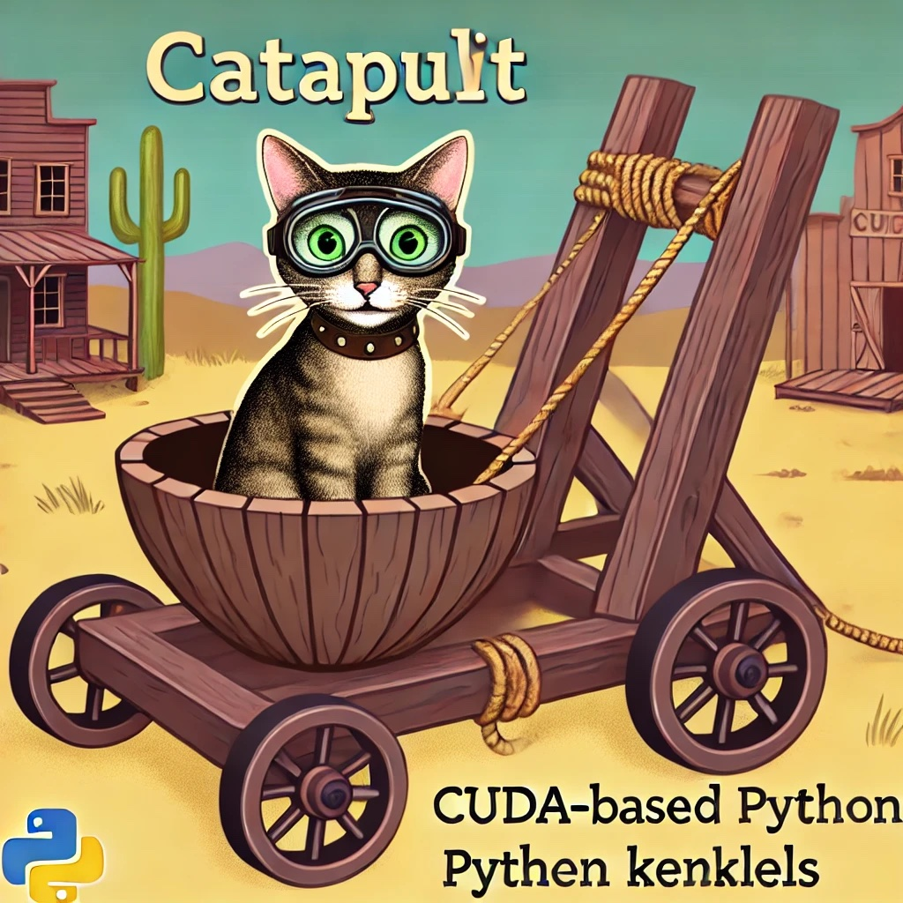

<h1 align="center" style="fontsize:50em"><b>CATapult: A GPU Kernel Launching Library</b></h1>




# Installation

Currently catapult can only be installed locally. However we have plans to create a PyPI package in the very near future of the project.

## Installing from PyPI

Instillation through pip is coming soon!


## Installing Catapult Locally

To install catapult locally run the following command to clone the repository:

```bash
git clone https://github.com/Hprairie/catapult.git
```

Then run the following command to setup the package and install dependencies:

```bash
pip install -e .
```

# Functionality

Catapult aims to abstract away the often tedious process of connecting GPU kernels to Python frameworks (e.g., PyTorch, Tensorflow, NumPy, etc.), enabling researchers, developers, and anyone else trying to learn to focus purely on developing the kernel and rather than using it. 

## Supported Systems

Currently catapult only supports the following backends and frameworks:


| Frameworks/Backends | CUDA               | AMD | Metal |
|---------------------|--------------------|-----|-------|
| PyTorch             | :heavy_check_mark: | :x: | :x:   |
| Tensorflow          | :x:                | :x: | :x:   |
| NumPy               | :x:                | :x: | :x:   |

While the library is currently under developement this list is subject to change. Contributions aiming to support to new backends and frameworks are greatly appreciated and welcomed!

## Library Requirements

Currently the library supports `python 3.9-3.12`. We also enforce the usage of newer versions of PyTorch to support Torch's `custom_op` module. We strongly belive that migrating towards this methodology for custom kernels is incredibly important to enabling the accessibility of effecient machine learning, by integrating fully with `torch.compile`.


## Support Functionality

Catapult aims to support all the interface functionality required to program custom GPU kernels. The following is a short list of functionality supported by catapult.

- JIT kernel compiliation
- Templated and non-templated kernel support
- Autoconfiguration
- Benchmarking
- Torch's `custom_op`
- ThunderKitten's automatic linking
- Header support
- Static `dtype`support
- Testing tools suite (Coming Soon)

# Example Usage

Consider the following file `example_kernel.cu`, which is defined below:

```cuda
extern "C" __global__
void saxpy(float a, float *x, float *y, float *out, size_t n) {
    size_t tid = blockIdx.x * blockDim.x + threadIdx.x;
    if (tid < n) {
        out[tid] = a * x[tid] + y[tid];
    }
}
```

To use catapult's auto-jit compiler we can create the following script with a defined kernel launching function:

```python
import torch
import catapult


@catapult.jit(kernel_path="example_kernel.cu", kernel_name="saxpy")
def testing(a, x, y, N):
    output = torch.zeros_like(x)

    testing.kernel[(32, 1, 1), (128, 1, 1)](a, x, y, output, N)
    return output
```

We can then use our function as PyTorch intends:

```python
NUM_THREADS = 128
NUM_BLOCKS = 32
N = NUM_THREADS * NUM_BLOCKS

# Allocate device memory using PyTorch
device = torch.device("cuda" if torch.cuda.is_available() else "cpu")
if device.type != "cuda":
    raise RuntimeError("CUDA device not available.")
a = 2.0
x = torch.rand(N, device=device, dtype=torch.float32)
y = torch.rand(N, device=device, dtype=torch.float32)

out = testing(a, x, y, N)
expected = a * x + y
print(out, expected)
if not torch.allclose(out, expected):
    raise ValueError("Kernel output does not match expected result")
```

While static kernels are useful, we really want to use a templated kernel so that a compiler can optimize our code more. To use templated kernels with catapult, consider the following `example_template.cuh` file:

```CUDA
```

Like the static kernel, we can write the launching script in Python for the templated kernel, but this time we need to specify the template inputs in the decorator:

```python
```

We can then use our function like the following:

```python
```

Nice we are getting somewhere! However, something that we also want to abstract away is kernel configuration. Based on the tensor shapes and hardware we want to automically test out different configurations at runtime and then automatically use the best. Like Triton's autoconfiguration, we can create different configurations of our kernel and Catapult will automically choose the best one at runtime. Using the same `example_template.cuh` kernel as above, we can use `catapult.autotune` and `catapult.Config` in the following kernel launcher:

```python
```

We can again then call the function like above:

```python
```

To print out the different configuration we can call our script with `CATAPULT_=1` to get the following:

```text
```

This example and more can be found in `examples/`. Also further tutorials and documentation can be found at (INSERT DOCUMENTATION WEBSITE WHEN DONE).

# Tests

To install the dependencies for the testing environment, you can run the following command:

```bash
make install-test
```

To run the test-suite for the project one can use the following command:

```bash
make test
```

# Benchmarks
Catapult is incredibly fast adding little to no overhead when it comes to kernel development. We belive that Catapult is tool for researchers to more conviently develop GPU kernels. We benchmark the following examples to compare the differences between developing a PyTorch extension and using Catapult. We touch on a few brief comparison between catapult and PyTorch extensions, but further examples and the resulting scripts can be found in [benchmarks.md](./benchmarks.md).

## GEMM Kernel

## Flash Attention

## Mamba2

# Contributing

Catapult is developed by students and thus community contributions are greatly appreciated. We believe that by building strong foundational tools to streamline the development of hardware aware deep learning, we can enable more efficient, scalable models. We are excited by the potential that catapult has to contribute towards that goal. 

Contributions adding more frameworks/backends, functionality, and tooling is greatly appreciated and welcomed. Contributions fixing bugs, creating stronger error messaging, and removing dead code are amazing and incredibly helpful to the project. 

More information on contributions can be found in [contributions.md](./contributions.md)

# References and Citation

We took a lot of inspiration for this repository from CuPy and Triton. We also heavily integrate ThunderKittens into the framework as we believe that it will be a fundemental tool in the developement of future GPU kernels and ML research. Citations to each of these tools can be found bellow. Thank you to all the developers of these libraries for creating beautiful and amazing tools.

**Triton**
```text
```

**CuPy**
```text
```

**ThunderKittens**
```text
```